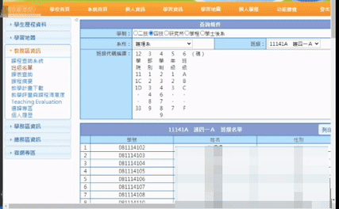
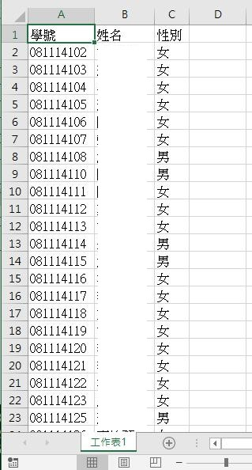

# 關於此專案
臺北護理健康大學登入後抓取班級名單功能
# 如何使用
## Download
```bash=
git clone https://github.com/Chinlinlee/GetNTUNHSClassNameList.git
```
## Configuration
位置`./SchoolClassList/node_modules`
```javascript
module.exports = {
    "account" : "帳號" , //改成你的北護入口網帳號 
    "password" : "密碼" , //改成你的北護入口網密碼
    "rdoEduSys" : ["rdoEduSys_1"]   //學制 由左至右 rdoEduSys_0:二技 , rdoEduSys_1:四技
}
```
## Run
第一次先運行以下指令
```bash=
cd SchoolClassList
npm install
```
接下來輸入
```bash
node test.js
```
# 運行效果


# 運行結果



# 此為學術用途